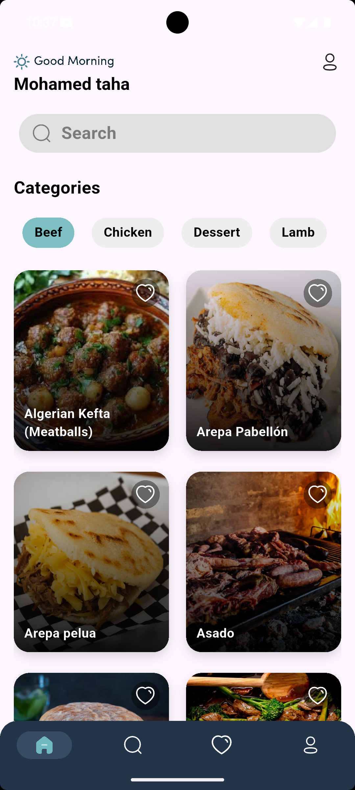
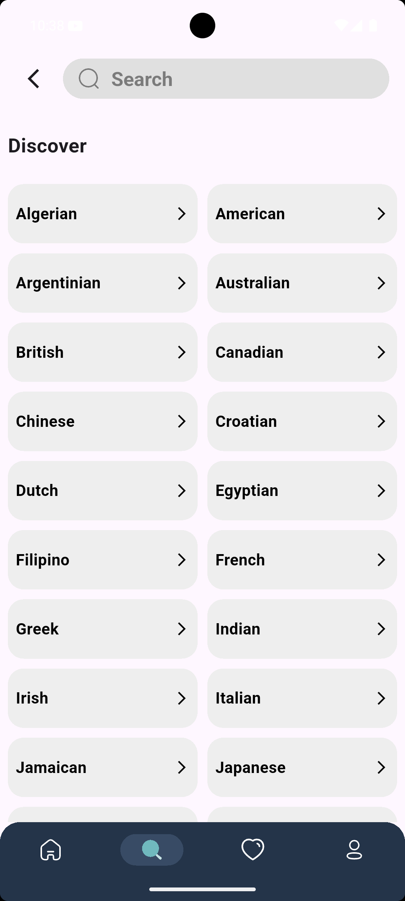
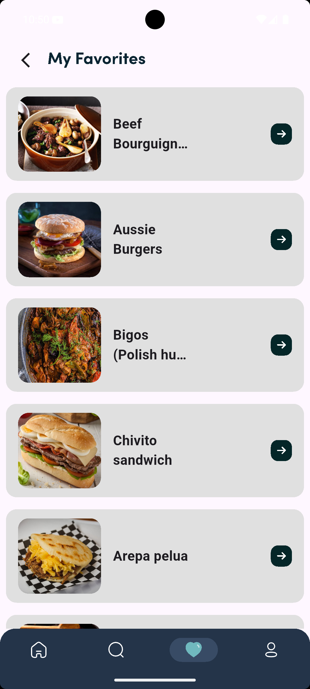
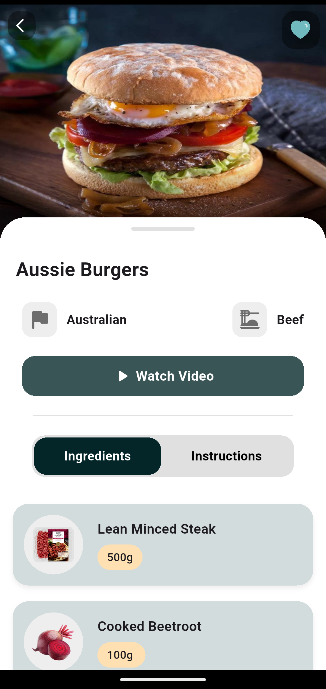
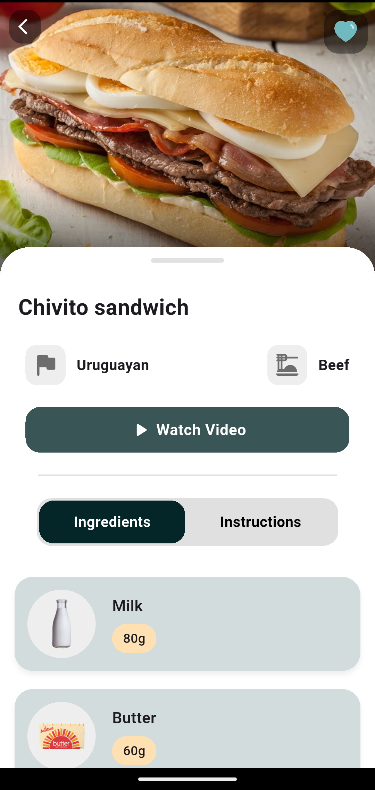
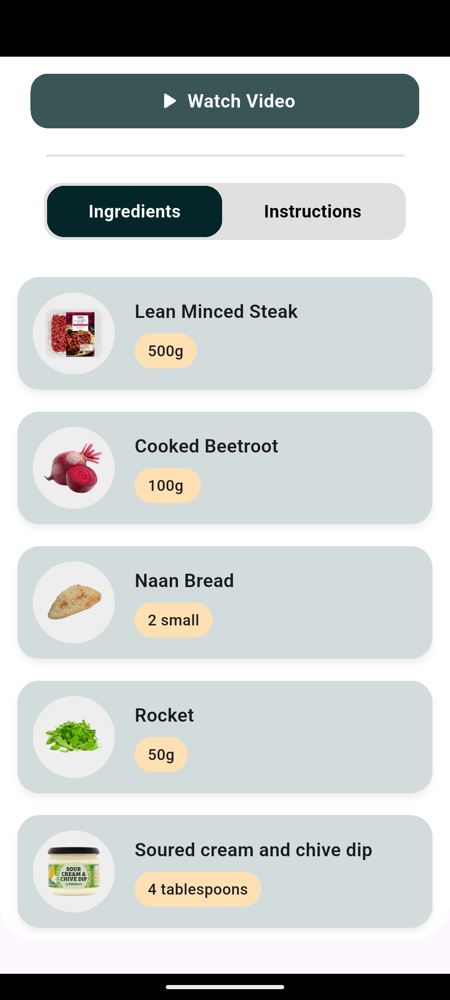
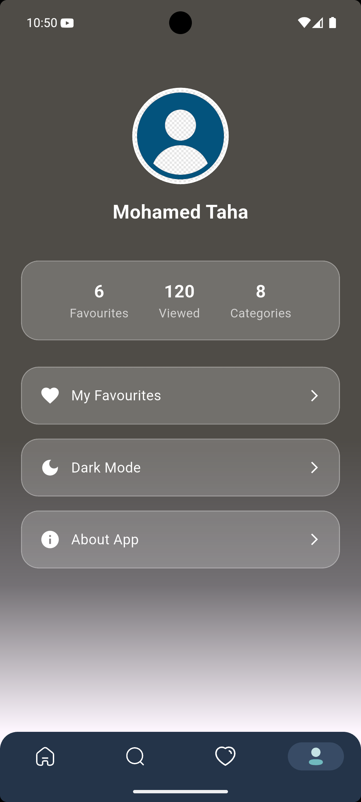
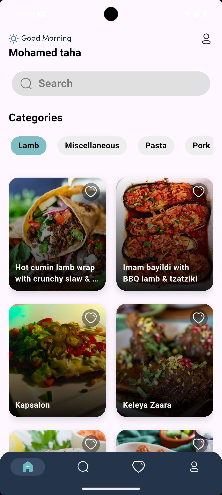

# 🍽 Recipe App

A modern and clean Flutter application that allows users to explore delicious recipes, view details, and save their favorite meals.

---

## 🚀 Features

* 🔍 Search meals by name
* 📂 Browse meals by category
* ❤️ Add / Remove favourites
* 📖 View detailed recipe instructions
* 🥘 Ingredients list with images
* ▶ Watch recipe videos on YouTube
* 🌙 Clean and modern UI

---

## 📸 Screenshots


| Home Screen                                        | Discover Screen                                      |
| -------------------------------------------------- | ---------------------------------------------------- |
|                |          |

| Search Screen                                      | Favourite Screen                                     |
| -------------------------------------------------- | ---------------------------------------------------- |
|            |       |

| Details Screen                                     | Details2 Screen                                      |
| -------------------------------------------------- | ---------------------------------------------------- |
|         |          |

| Ingrediants Screen                                 | Instructions Screen                                  |
| -------------------------------------------------- | ---------------------------------------------------- |
|  |  |

| Profile Screen                                     | Home2 Screen                                         |
| -------------------------------------------------- | ---------------------------------------------------- |
|          |         |

---

## 🛠 Tech Stack

* Flutter
* Dart
* REST API
* Hive (Local Storage)
* Bloc (State Management)

---

## 🌐 API Used

* TheMealDB (Free Recipe API)

---

## 📦 Packages Used

* http
* flutter_bloc
* hive
* hive_flutter
* url_launcher
* flutter_svg

---

## 📂 Project Structure

lib/
├── models/
├── services/
├── cubits/
├── views/
├── widgets/
├── shimmers/

---

## ▶ Getting Started

1. Clone the repo

```bash
git clone https://github.com/your-username/recipe_app.git
```

2. Navigate to project

```bash
cd recipe_app
```

3. Install dependencies

```bash
flutter pub get
```

4. Run the app

```bash
flutter run
```

---


---

## 👨‍💻 Developed By

**Mohamed Taha**  
Flutter Developer

---

## ⭐ Don't forget to star the repo if you like it!

